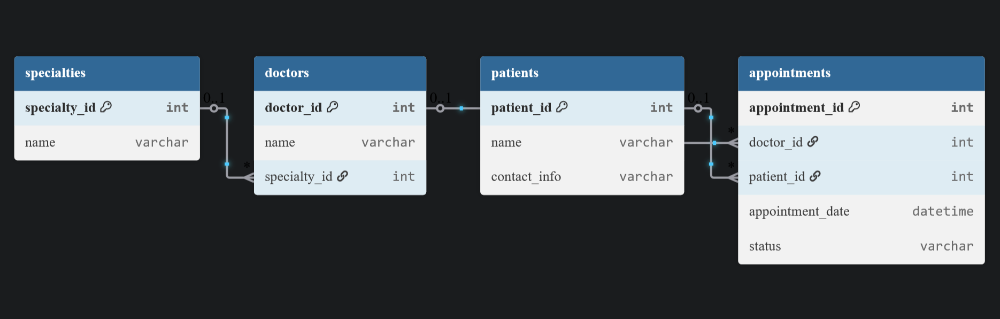

# 📅 Week 8 Assignment – Clinic Booking System

## 📋 Overview

Relational database schema design for a medical clinic appointment scheduling system using **MySQL**.  
**Focus**: normalized data structure, data integrity, and performance.

## 🎯 Objectives

- Apply database normalization techniques: First Normal Form (1NF) and Second Normal Form (2NF)  
- Create tables with appropriate constraints: `PRIMARY KEY`, `FOREIGN KEY`, `UNIQUE`, `NOT NULL`  
- Define and enforce relationships between entities (e.g., One-to-Many)

## 🗃️ Schema Overview

The following tables, all normalized up to **Second Normal Form (2NF)**, are created in the `clinicDB` database:

- `specialties`: Stores medical specialty information
- `doctors`: Profiles for each doctor, linked to a specialty
- `patients`: Patient records with personal details
- `appointments`: Tracks patient bookings with doctors

## 🔽 Visual Schema

> 💡 A dark version of the diagram is also available in the repository under `assets/clinic-schema-dark.png`.

## ⚙️ How to Run

1. Open **MySQL Workbench** or your preferred SQL client
2. Execute the `clinicDB.sql` script
3. The script will:
   - Create the `clinicDB` database  
   - Create all required tables  
   - Define all necessary constraints

## ✅ Requirements

- MySQL **8.x**
- Basic understanding of SQL syntax:  
  - DDL (Data Definition Language)  
  - Constraints (e.g., `NOT NULL`, `PRIMARY KEY`, `FOREIGN KEY`)

## 📝 License

This project is licensed under the MIT License.  
See the [LICENSE](LICENSE) file for details.

## 👨‍💻 Author

**Augusto Mate** – [mate.augusto.mz@gmail.com](mailto:mate.augusto.mz@gmail.com)

---

> Prefer a simplified or more formal version?  
> See [README_plain.md](./README_plain.md)
